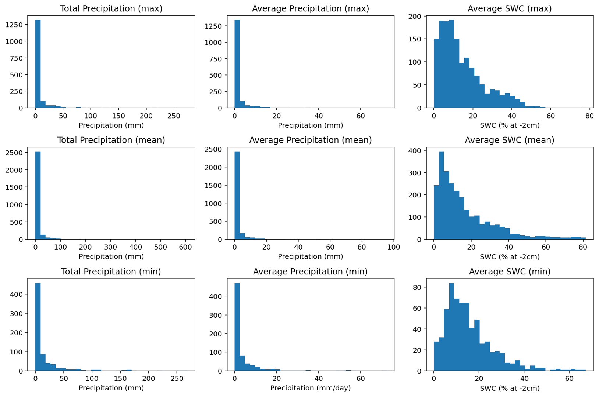
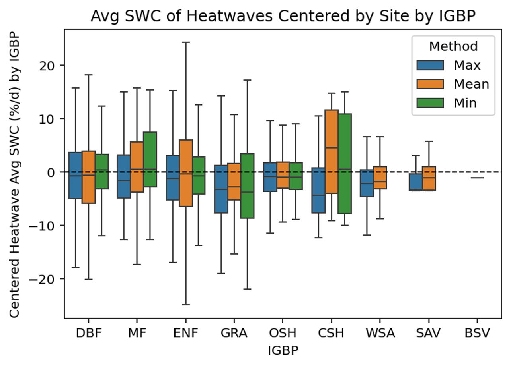
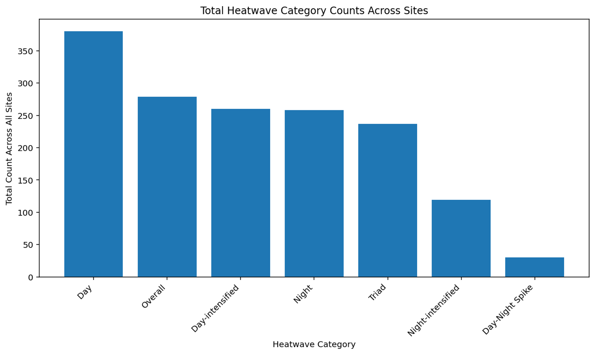
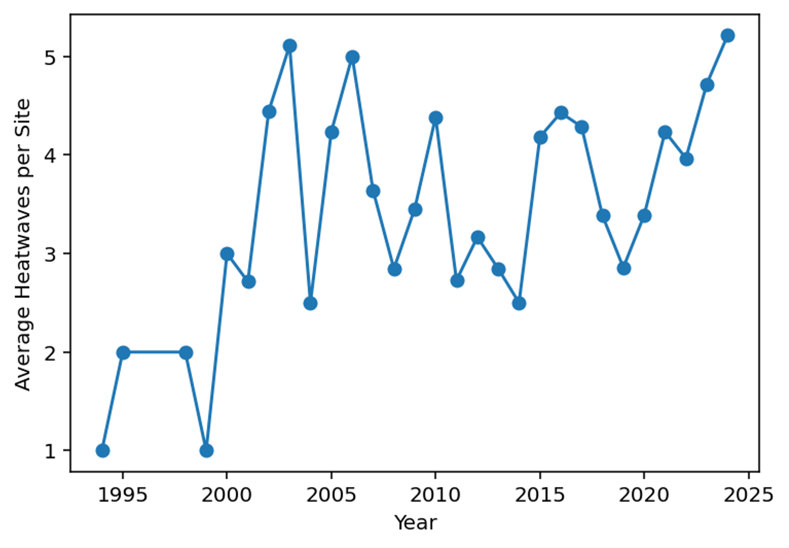
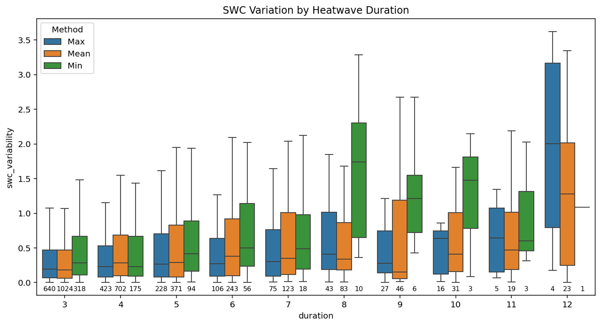

<!-- HeatwaveTrends README (HTML) -->

<h1>HeatwaveTrends</h1>

</strong>Analyzing trends in novel heatwave definitions and applying recurrent neural network to understand legacy effects</strong>

<h2>TLDR</h2>

</strong/>HeatwaveTrends</strong> applies <strong>algorithms</strong> to integrated weather tower station data and 30 years of satellite temperature data 
in order to identify novel definitions of heatwave types based on daily minimum, maximum, and average temperatures across 130 sites in the United States. 
Data analysis is performed to understand trends in heatwaves over time and across different ecosystem types. Rigorous data cleaning, preprocessing, QAQC,
and heatwave definitions have been performed in preparation for application of a recurrent neural network to understand the lasting impacts of a heatwave
on ecosystem health.

<h2>Highlights</h2>
<ul>
  <li><strong>Detailed QA/QC</strong>: adjusted satellite data based on in-situ tower station data</li>
  <li><strong>Satellite Data Bias Adjustment</strong>: adjusted satellite data based on in-situ tower station data</li>
  <li><strong>Heatwave Algorithm</strong>: crafted algorithm to define various types of heatwaves based on historical temperatures</strong></li>
  <li><strong>Deep Learning</strong>: currently desigining LSTM to understand lasting impacts of heatwaves</li>
</ul>

<h2>Data Visualization</h2>

  
  
  
  
  
  

<h2>Skills</h2>
<ul>
  <li><strong>Languages</strong>: Python</li>
  <li><strong>Libraries</strong>: TensorFlow, pandas, matplotlib</li>
  <li><strong>Compute</strong>: HPC cluster for large-scale processing</li>
  <li><strong>Data Source</strong>: <a href="https://prism.oregonstate.edu/">PRISM Data</a></li>
</ul>

<h2>Workflow Overview</h2>
<pre>
carbonflux/
├── figures/                # Data Visualizations from analysis
├── preprocessing/          # Functions and scripts for cleaning and adjusting data
├── heatwave_definition/    # Key functions and scripts for defining and analyzing heatwaves
└── README.md
</pre>

<h2>WHAT'S NEXT?</h2>

These heatwave definitions are now being used in an LSTM to determine how heatwave events leave lasting impacts
  on ecosystems. Stay tuned to see this happen!

<h2>Contact</h2>

  For questions or collaboration: <strong>marleeyork2025@gmail.com</strong> 

