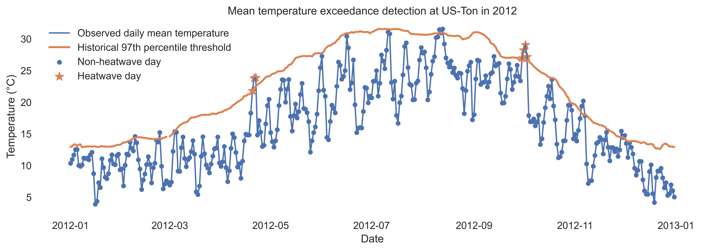
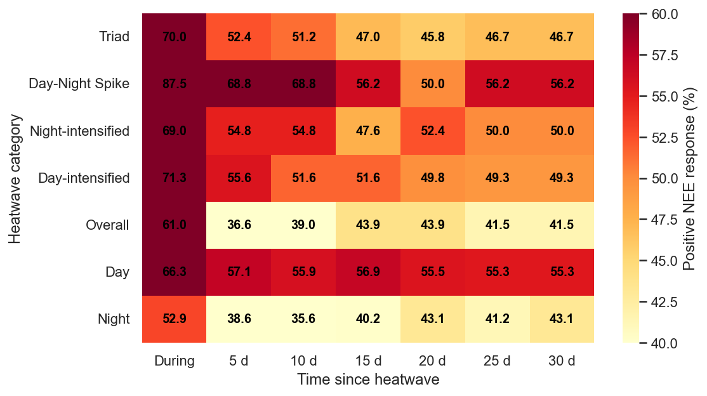
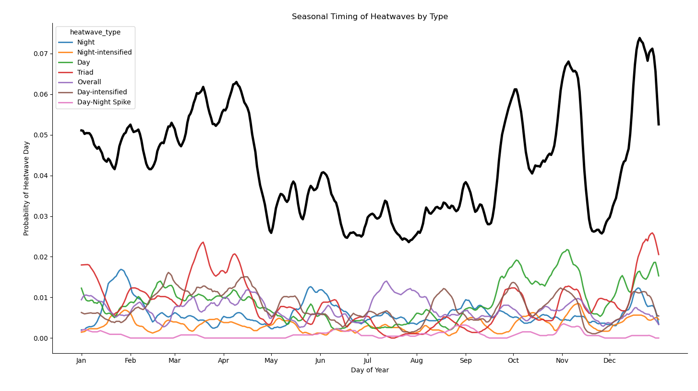
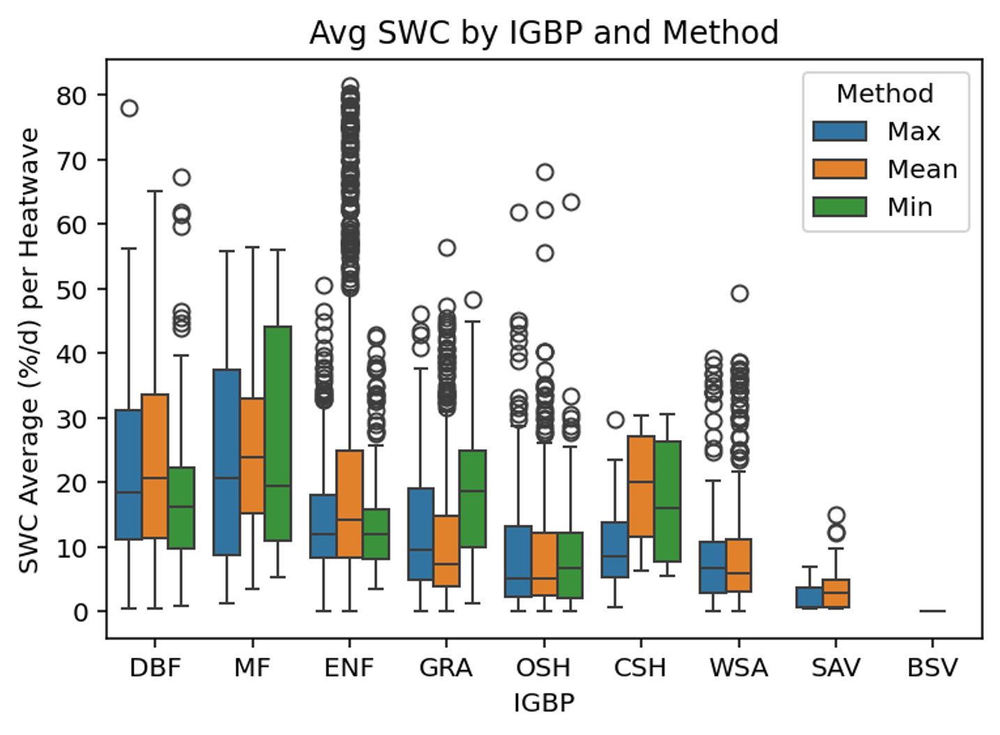
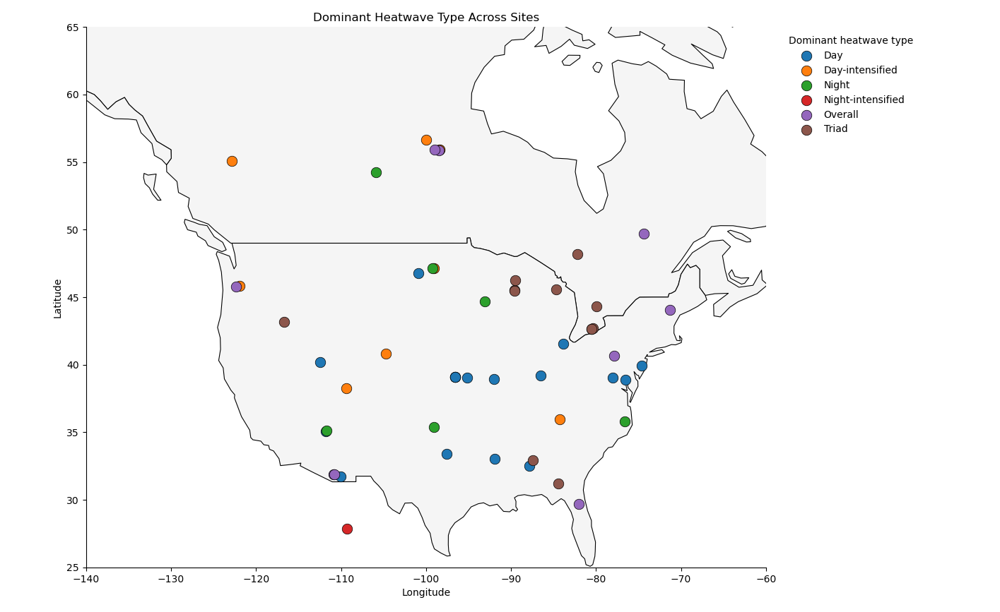

<!-- <h2> 🚧 HeatwaveTrends README 🚧 (HTML) <h2> -->

<h1>HeatwaveTrends</h1>

</strong>Analyzing trends in novel heatwave definitions and applying recurrent neural network to understand legacy effects</strong>

<h2>TLDR</h2>

Existing heatwave definitions often fail to capture the full range of heat stress experienced by ecosystems; therefore, I developed a comprehensive heatwave classification framework and evaluated how different forms of heat stress influence gross primary production (GPP), ecosystem respiration (Reco), and net ecosystem exchange (NEE) across diverse ecosystems in the western United States. We integrated long-term (1994–2024) carbon flux observations from 54 FLUXNET sites with historical climate data to identify distinct heatwave types and quantify ecosystem responses during and following heatwave events.

<h2>Data Visualization</h2>

  
  
  
  
  

<h2>Highlights</h2>
<ul>
  <li><strong>Detailed QA/QC</strong>: adjusted satellite data based on in-situ tower station data</li>
  <li><strong>Satellite Data Bias Adjustment</strong>: adjusted satellite data based on in-situ tower station data</li>
  <li><strong>Heatwave Algorithm</strong>: crafted algorithm to define various types of heatwaves based on historical temperatures</strong></li>
  <li><strong>Deep Learning</strong>: currently desigining LSTM to understand lasting impacts of heatwaves</li>
</ul>

<h2>Skills</h2>
<ul>
  <li><strong>Languages</strong>: Python</li>
  <li><strong>Libraries</strong>: TensorFlow, pandas, matplotlib</li>
  <li><strong>Compute</strong>: HPC cluster for large-scale processing</li>
  <li><strong>Data Source</strong>: <a href="https://prism.oregonstate.edu/">PRISM Data</a></li>
</ul>

<h2>Workflow Overview</h2>
<pre>
carbonflux/
├── figures/                # Data Visualizations from analysis
├── preprocessing/          # Functions and scripts for cleaning and adjusting data
├── heatwave_definition/    # Key functions and scripts for defining and analyzing heatwaves
└── README.md
</pre>

<h2>WHAT'S NEXT?</h2>

These heatwave definitions are now being used in an LSTM to determine how heatwave events leave lasting impacts
  on ecosystems. Stay tuned to see this happen!

<h2>Contact</h2>

  For questions or collaboration: <strong>marleeyork2025@gmail.com</strong> 

